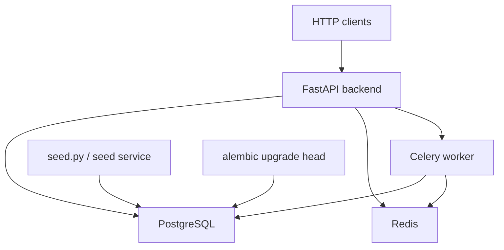
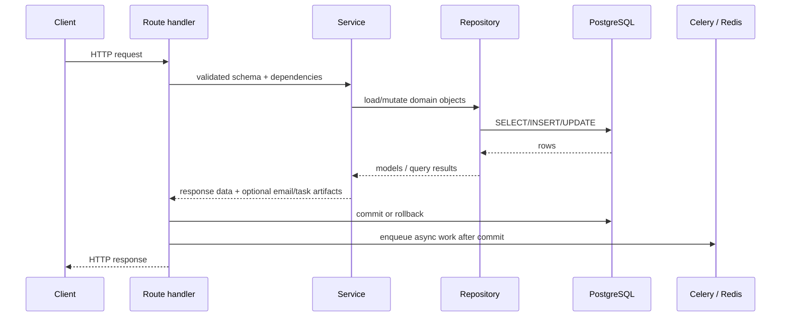
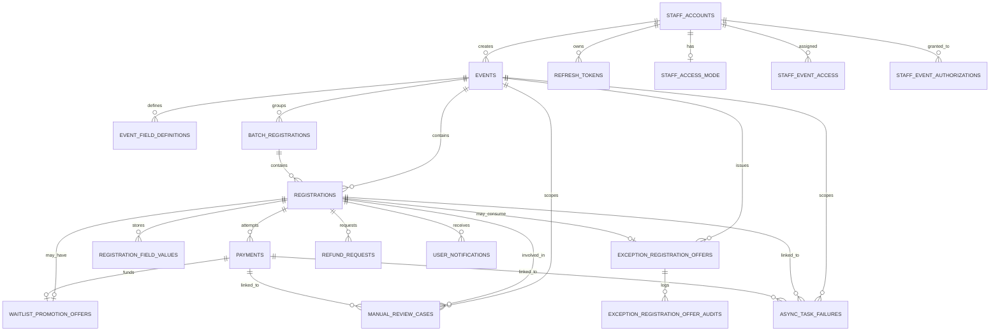
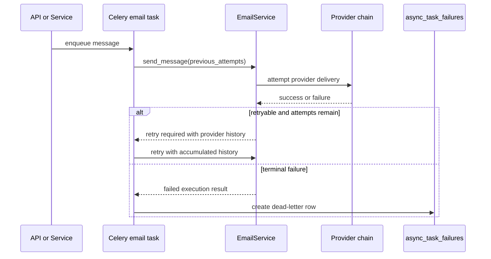

# Technical Implementation

This document explains the backend as it exists in code today. It is written for contributors who need to understand how requests move through the system, how data is modeled, how background work is handled, and where the main business rules live.

It does not describe unimplemented roadmap ideas. Every section here is tied to code in `app/`, `alembic/`, `tests/`, `seed.py`, and the backend-local runtime files.

## 1. Runtime Overview

The backend is a FastAPI application backed by PostgreSQL and Redis. Celery handles asynchronous work and periodic jobs. Alembic manages schema evolution. The backend can run as a self-contained stack from the `backend/` directory through its own `docker-compose.yml`.

### Runtime components

- API server: `uvicorn app.main:app`
- Background worker and beat scheduler: `celery -A app.workers.tasks worker --beat`
- Database: PostgreSQL 15
- Queue and Celery result backend: Redis
- Migrations: Alembic
- Seed runner: `python seed.py`

### Container/runtime topology

## 2. Codebase Structure

The implementation is organized by responsibility rather than by a single framework layer.

- `app/main.py`
  - FastAPI application setup and `/health`
- `app/api/`
  - versioned HTTP routes
- `app/core/`
  - settings, auth helpers, dependency wiring, exception types
- `app/db/`
  - SQLAlchemy base and async session factory
- `app/models/`
  - SQLAlchemy models and enums
- `app/repositories/`
  - query and persistence helpers
- `app/services/`
  - business logic and orchestration
- `app/workers/`
  - Celery app and task entrypoints
- `app/utils/`
  - CSV and PDF export helpers
- `alembic/`
  - schema revisions
- `tests/`
  - API, service, schema, and integration-style verification
- `seed.py`
  - idempotent demo/dev dataset

## 3. Application Entry and Settings

### FastAPI entrypoint

`app.main:app` creates the FastAPI application, registers the versioned router, and uses a lifespan hook to ensure runtime directories exist.

The public health endpoint is:

- `GET /health`

### Settings model

Configuration is centralized in `app/core/config.py` using `pydantic-settings`.

Current settings groups include:

- database and Redis URLs
- JWT secret and token lifetimes
- payment gateway selection and provider credentials
- application base URL
- waitlist promotion expiry defaults
- email provider selection, failover chain, and provider credentials

The backend-local `.env.example` matches the current runtime expectations in code and Docker Compose.

## 4. Request Lifecycle and Transaction Model

The codebase uses a clear route-to-service-to-repository flow.

### Request flow

### Why commit happens in routes

Most routes define a small `_commit_or_rollback()` helper and call it after the service returns successfully. This keeps transaction boundaries explicit in the HTTP layer.

Practical effect:

- services can compose multiple repository calls without committing on their own
- routes decide whether queued email work should run
- if a route rolls back, queued side effects are not dispatched

This pattern is used consistently across auth, admin, public, and staff routes.

## 5. Error Model

The backend uses custom exception classes in `app/core/exceptions.py`.

Important traits:

- errors carry HTTP-oriented categories such as `ValidationError`, `ConflictError`, `NotFoundError`, and `AuthorizationError`
- route handlers map `AppError` instances to HTTP responses
- some errors carry extra payload fields used by the registration API for duplicate warnings
- `commit_changes=True` is used in a few edge cases where state changes should survive the error response, such as expiring an already-stale exception offer during a consume or revoke attempt

This keeps error responses predictable without pushing HTTP-specific code into the repository layer.

## 6. Data Model

The core model is event-centric. Staff accounts create and manage events. Registrations attach to events. Payments, refunds, offers, reviews, and notifications extend the registration lifecycle.

### High-level entity map

### Main tables

- `staff_accounts`
  - admin/staff accounts, login identity, active flag
- `refresh_tokens`
  - stored refresh token hashes and revocation timestamps
- `staff_access_mode`, `staff_event_access`
  - global vs selected-event staff access
- `events`
  - event metadata, state, price, capacity, overflow rule, creator
- `event_field_definitions`
  - admin-defined registration fields
- `registrations`
  - one row per attendee, including state, check-in, waitlist, cancellation history, current payment pointer
- `registration_field_values`
  - submitted values for custom fields
- `batch_registrations`
  - batch submitter container for multi-attendee paid/free batch flows
- `payments`
  - single registration or batch payment attempts
- `refund_requests`
  - refund lifecycle separate from registration state
- `waitlist_promotion_offers`
  - paid waitlist promotion state and public token
- `staff_event_authorizations`
  - event-scoped delegated permissions
- `exception_registration_offers`
  - event creator/delegate-issued exception offer records
- `exception_registration_offer_audits`
  - immutable offer action trail
- `manual_review_cases`
  - operational review queue for requeue and late-payment scenarios
- `async_task_failures`
  - dead-letter store for terminal async failures, currently used by email tasks
- `user_notifications`, `staff_notifications`
  - in-app notification records

## 7. Schema Evolution by Phase

Schema evolution is tracked in Alembic and reflects the feature phases that were actually implemented.

### `20260426_01_initial_schema`

Introduced the base system:

- staff accounts and access mode
- events and custom field definitions
- registrations and batch registrations
- registration field values
- payments with one-owner constraint
- user and staff notifications

At this point, registration state still included refund-related states.

### `20260426_02_add_refresh_tokens`

Added persistent refresh token storage for login sessions.

### `20260517_01_add_waitlist_promotion_offers`

Added paid waitlist promotion offers with:

- public token
- expiry
- status
- optional linked payment

### `20260518_01_add_staff_event_authorizations`

Added event-scoped delegated permissions for:

- exception offer management
- overflow-rule changes
- manual review management
- registration requeue

### `20260519_01_add_exception_registration_offers`

Added:

- exception registration offers
- single-use public tokens
- payment waiver and capacity override flags
- audit log table

### `20260519_02_add_refund_requests_and_registration_cancel_fields`

Moved refund lifecycle out of `registrations.state` and introduced:

- `refund_requests`
- historical waitlist fields on `registrations`
- cancellation reason tracking

The migration also converted legacy refund-related registration states into refund request rows and normalized registration state back to `cancelled`.

### `20260519_03_add_manual_review_cases_and_payment_attempt_support`

Added:

- multiple payment attempts per registration
- `registrations.current_payment_id`
- `payments.attempt_number`
- manual review case table

This is the key revision that changed payment handling from one payment per registration to an attempt-based model.

### `20260519_04_add_async_task_failures`

Added the generic dead-letter table for terminal async failures.

### `20260520_01_extend_async_task_failures_with_operational_fields`

Added operational lifecycle metadata:

- acknowledged/resolved actor IDs
- timestamps
- resolution notes

## 8. Authentication and Authorization

### Authentication flow

Authentication is email/password based for staff and admin accounts.

Implemented endpoints:

- `POST /auth/login`
- `POST /auth/refresh`

How it works:

1. password is checked with bcrypt
2. access token and refresh token are created
3. refresh token hash is stored in `refresh_tokens`
4. refresh flow validates:
   - JWT type
   - token hash
   - expiry
   - revocation state
   - active staff account

### Access rules

Base dependency helpers live in `app/core/dependencies.py`.

- `require_admin`
  - restricts admin routes to `StaffRole.ADMIN`
- `get_current_account`
  - resolves any authenticated staff/admin account

### Staff access model

There are two layers of access control for non-admin staff:

1. access mode
   - `all_events`
   - `selected_events`
2. event-scoped delegated authorizations
   - for manual review/requeue
   - and, for admins, delegated exception offer / overflow management

### Event creator model

Some sensitive actions are limited to the event creator or an explicitly delegated admin:

- exception registration offers
- overflow-rule changes
- grant/revoke of event-scoped authorizations

## 9. Event Management

Event logic lives primarily in `EventService` and `EventRepository`.

### Event creation and update

Implemented behaviors include:

- prefix format validation
- non-negative price validation
- optional capacity
- custom field display-order validation
- immutable prefix after creation
- event state transitions

### Public vs admin event views

Public event endpoints expose:

- published events only
- event metadata
- custom field definitions
- capacity, if set

They do **not** expose `slots_remaining`.

Admin event endpoints expose:

- all event states
- registration counts
- refund count projections
- `capacity_override_count`
- `slots_remaining`

### Overflow rule management

Overflow rule changes are handled through a dedicated path, not the generic event update route.

When switching from `waitlist` to `hard_rejection`:

- active waitlisted registrations are moved to `cancelled`
- `was_waitlisted` is preserved
- `previous_waitlist_position` is preserved
- `cancellation_reason` becomes `overflow_rule_changed`

Switching back to `waitlist` does not reactivate historical records.

## 10. Registration Flows

Registration logic is centered in `RegistrationService` and `RegistrationRepository`.

### Single registration

`POST /register/{event_id}`

Behavior:

- event must not be draft, cancelled, or completed
- custom field values are validated against event field definitions
- duplicate checks are state-aware
- if capacity exists, `pending_payment` and `confirmed` consume slots
- when full:
  - `hard_rejection` rejects
  - `waitlist` creates a waitlisted registration

### Batch registration

`POST /register/{event_id}/batch`

Behavior:

- minimum 4 participants
- checks duplicate emails within the batch
- checks event-level duplicates using current duplicate rules
- submitter is not implicitly a participant
- one `batch_registrations` row groups the participants

### Registration state model

Current `RegistrationState` values:

- `pending_payment`
- `confirmed`
- `failed`
- `cancelled`
- `waitlisted`

Refunds are not encoded here anymore.

### Duplicate rules

The repository blocks duplicates for:

- `pending_payment`
- `confirmed`
- `waitlisted`
- any registration with an active refund request in `requested` state

Historical records that no longer block re-registration include:

- `failed`
- `cancelled`
- refund requests that have moved beyond active blocking status

## 11. Payment Model and Processing

### Payment initialization

Payment creation lives in `PaymentService`.

Current providers:

- mock
- Paystack
- Squad

The active provider is selected from settings.

### Multiple attempts per registration

After Phase `13.5A.4`, a registration can have multiple payment attempts.

Implementation details:

- each payment attempt has an `attempt_number`
- `registrations.current_payment_id` points to the current actionable payment
- older attempts remain in history

This is important for:

- requeue flows
- payment retry visibility
- analytics

### Webhooks and mock endpoints

Implemented payment HTTP surfaces:

- Paystack webhook
- Squad webhook
- mock confirm endpoint
- mock fail endpoint

Webhook routes validate signatures, normalize provider-specific payloads, and then enqueue Celery processing rather than completing the whole workflow inline.

### Payment processing rules

`PaymentProcessingService` handles:

- success
- failure
- duplicate success idempotency
- duplicate failed-event idempotency
- late success after failure/expiry
- stale pending payment expiry

Late payment success does not automatically restore the original business flow. Instead, it moves into manual review.

## 12. Notifications and Lookup

`NotificationService` handles:

- user notification creation
- staff notification creation
- registration lookup shaping
- event cancellation messaging
- price change messaging
- refund completion/approval/rejection dispatch
- payment retry notification

### Registration lookup

`GET /registrations/lookup`

Returns:

- registration summary
- event summary
- current payment summary if present
- waitlist promotion offer summary
- latest refund request summary
- unseen user notifications

Lookup also surfaces historical waitlist context for cancelled former-waitlist registrations.

### Dispatch pattern

Routes commit the transaction first, then enqueue email messages returned by services.

This avoids sending emails for failed transactions.

## 13. Waitlist Promotion

The paid waitlist flow is implemented in `WaitlistPromotionService`.

### What it does

- lets staff/admin promote a paid waitlisted registration into a payment offer
- creates a `waitlist_promotion_offers` row with expiry and token
- moves the registration to `pending_payment`
- resequences remaining waitlist positions
- generates in-app and email messaging

### Important rules

- only paid waitlisted registrations can be promoted manually
- event must be capacity-limited and use `waitlist`
- capacity must actually be available
- free-event automatic promotion is handled elsewhere through notification/cancellation flow

### Offer expiry

Periodic Celery work expires stale offers and marks linked payments/registrations failed where appropriate.

## 14. Exception Registration Offers

Exception registration is implemented in `ExceptionRegistrationService`.

### Core behavior

- event creator can issue an offer
- delegated admin can issue an offer only with event-scoped permission
- public token is single-use
- offer can override capacity
- paid offers may waive payment
- audit entries are written for issue, attempt, success, rejection, revocation, and expiry

### Public consumption

`POST /registrations/exception-offers/{public_token}/register`

Behavior:

- validates token state and expiry
- enforces targeted email match
- applies normal custom field validation
- respects state-aware duplicate blocking
- creates:
  - `confirmed` registration for free or waived flows
  - `pending_payment` registration for paid non-waived flows

### Capacity override

Capacity override counts are preserved in event admin views and analytics by joining active used exception offers back to registrations.

## 15. Refunds and Self-Service Cancellation

Refund logic moved into `RefundService` after the registration-state refactor.

### Cancellation

`PATCH /registrations/{reg_id}/cancel`

Allowed when the registration is:

- `confirmed`
- `pending_payment`
- `waitlisted`

Blocked when:

- already failed/cancelled
- checked in

Effects include:

- marking pending current payment failed if needed
- preserving waitlist history
- cancelling active waitlist payment offers
- potentially promoting the next waitlisted attendee for free events

### Refund requests

`POST /registrations/{reg_id}/refund-requests`

Allowed only when:

- registration is already cancelled
- successful payment history exists
- there is no active refund request already

Admin processing happens through:

- `GET /admin/refund-requests`
- `PATCH /admin/refund-requests/{refund_request_id}`

Refund updates may dispatch either in-app or email notifications depending on the chosen notification method.

## 16. Manual Review and Requeue

Manual review behavior is implemented in `ManualReviewService`.

### Manual review cases

Cases can be:

- system-created, such as late payment success
- staff-created during requeue work

Available statuses:

- `open`
- `in_progress`
- `resolved`
- `dismissed`

### Requeue

`PATCH /staff/registrations/{reg_id}/requeue`

Behavior:

- only for failed paid registrations
- only for authorized admin/staff
- capacity is checked unless the registration came through a capacity override path
- creates a fresh payment attempt
- points `current_payment_id` to the new attempt
- moves registration back to `pending_payment`
- optionally notifies the user with a payment retry message

### Payment re-initialization

Public re-initialization uses:

- `POST /registrations/{reg_id}/payments/initialize`

This reuses the current pending payment when possible or prepares a new one in requeue-driven scenarios.

## 17. Dead-Letter Store and Email Delivery

### Dead-letter store

`async_task_failures` is a generic table for terminal async failures.

Current producer:

- email task terminal failures

Access:

- admin can read and update any dead-letter entry
- staff can access only event-bound entries when they have:
  - event access
  - `can_manage_manual_reviews`

Lifecycle states:

- `open`
- `acknowledged`
- `resolved`

### Email delivery flow

Email sending uses `EmailService` plus provider implementations under `app/services/email_providers/`.

Special providers:

- `mock`
- `console`

Real delivery providers:

- `resend`
- `zoho_mail`
- `sendgrid`
- `mailgun`
- `amazon_ses`

### Failover model

The email service resolves a provider attempt sequence from:

- `EMAIL_PROVIDER`
- `EMAIL_PROVIDER_FAILOVER_CHAIN`
- `EMAIL_PROVIDER_ATTEMPTS_PER_PROVIDER`

Current behavior:

- if the active provider is `mock` or `console`, no real failover chain is used
- otherwise it builds a chain of configured real providers
- retryable provider failures move to the next allowed provider attempt
- message validation failures do not cascade through the whole chain

### Email failure sequence

Dead-letter payload metadata is sanitized before storage.

## 18. Analytics and Exports

Analytics is implemented in:

- `AnalyticsRepository`
- `AnalyticsService`
- `app/api/v1/admin/analytics.py`

### Implemented endpoints

- `GET /admin/analytics`
- `GET /admin/analytics/registrations`
- `GET /admin/analytics/download`

### Source-of-truth decisions currently in code

- refund metrics are derived from `refund_requests`
- operational capacity treats `confirmed + pending_payment` as slot-consuming
- batch revenue is normalized so a shared batch payment is not multiplied across attendee rows
- exception-offer capacity overrides are counted explicitly

These choices are documented directly in `AnalyticsService` comments because they intentionally differ from older assumptions in earlier phases.

### Download behavior

Downloads are generated synchronously in the API process:

- CSV is streamed row-by-row from a temp file
- PDF is written to a temp file and then streamed

This is the current implementation; exports are not background jobs.

## 19. Background Jobs

The Celery application is defined in `app/workers/tasks.py`.

### Included tasks

- email sending
- payment webhook processing
- stale payment expiry
- stale waitlist promotion expiry

### Beat schedule

Current periodic jobs run every 300 seconds:

- expire stale payments
- expire stale waitlist promotion offers

### Task database access pattern

Worker tasks create their own SQLAlchemy engine/session from configured database URLs rather than reusing web request sessions.

## 20. Testing Strategy

The test suite is intentionally close to the runtime behavior.

### Test infrastructure

- Alembic migrates the test database to head before the session starts
- tables are truncated between tests
- HTTP requests use `httpx.AsyncClient` with `ASGITransport`
- app dependencies are overridden for database session injection
- queued email and payment tasks are monkeypatched in tests

### Test coverage structure

The suite is grouped by subsystem:

- `test_auth.py`
- `test_events.py`
- `test_registration.py`
- `test_payment_service.py`
- `test_payments.py`
- `test_notifications.py`
- `test_waitlist_promotions.py`
- `test_event_authorizations.py`
- `test_exception_registrations.py`
- `test_self_service_registrations.py`
- `test_manual_reviews.py`
- `test_analytics.py`
- `test_downloads.py`
- `test_async_task_failures.py`
- `test_seed.py`
- `test_db_schema.py`

### What the tests prove

The suite covers:

- schema shape and migration head revision
- auth flows and token lifecycle
- event rules and visibility
- registration state and duplicate rules
- payment and webhook behavior
- notifications and lookup
- waitlist and exception-offer flows
- refunds and self-service actions
- manual review and dead-letter operations
- analytics/export correctness
- seed idempotency and usability

## 21. Seed Implementation

`seed.py` is a standalone async script that populates a realistic local dataset.

### Design goals in code

- additive rather than destructive
- stable business keys for idempotency
- complete enough to drive local demos, analytics, and UI work

### Current seed coverage

The seed includes:

- multiple staff roles and access modes
- event creator, delegated admin, and staff authorization scenarios
- events in draft, published, completed, and cancelled states
- free and paid registrations
- batch registrations
- multiple payment attempts
- refunds
- waitlist promotions
- exception offers and audits
- manual review cases
- dead-letter failures
- user and staff notifications

### Seed runtime

The backend-local Compose file includes a dedicated `seed` service:

- runs `alembic upgrade head`
- runs `python seed.py`

## 22. Backend-Local Docker and Deployment Flow

This repository now includes its own:

- `docker-compose.yml`
- `.env.example`
- `.gitignore`
- `.dockerignore`

### Current deployment-oriented flow in this repository

1. provide `.env`
2. start `db` and `redis`
3. run `migrate`
4. run `backend` and `worker`
5. optionally run `seed`

This is the hostable, self-running workflow present in the repository today.

There are no Kubernetes manifests, Terraform modules, or cloud deployment descriptors in this backend. The practical deployment surface currently documented by the codebase is the Dockerfile plus the backend-local Docker Compose stack.

## 23. Tradeoffs and Constraints Present in the Implementation

These are real properties of the current code, not generic design advice.

- Transaction control is explicit in routes rather than abstracted into middleware or a unit-of-work helper.
- Some service logic calls internal helper methods from other services, which keeps behavior consistent but couples service boundaries more tightly.
- Analytics and exports are synchronous request-time operations, not async export jobs.
- Public and admin event representations intentionally differ on capacity visibility.
- Email dead-letter recording currently covers email tasks only, even though the schema is generic enough for future async task types.
- Payment provider support is configurable, but availability depends on credentials actually being present in settings.
- The worker runs beat in the same process as the Celery worker in the current Compose setup.

## 24. Contributor Guidance

When extending the backend:

- add or change schema through Alembic revisions
- keep database access in repositories
- keep business decisions in services
- keep commit/rollback ownership in routes unless the project’s transaction pattern is intentionally changed
- enqueue async side effects only after successful commits
- update or extend the seed data through stable, idempotent keys
- add focused tests alongside the subsystem you changed

For a higher-level onboarding guide, use `README.md`. For the runtime/feature-level explanation, use this document.
